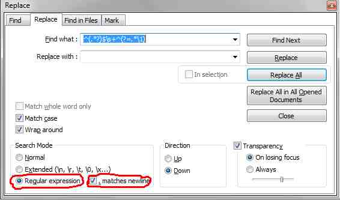

# Remove duplicate rows in Notepad++ [^1]

|   |   |
-|-
Find what: | `^(.*?)$\s+?^(?=.*^\1$)`
Replace with: | ` `
Regular expression | [x]
'.' matches newline | [x]

-|-
-|-
`(.*?)`	| any characters 0+ but as few as possible.   It matches exactly on row, this is needed because of the ". matches newline" option.   The matched row is accessible using \1.
`\s+?^` | all whitespaces incl. newlines till the start of the next row.   This removes the newlines after the matched row, so that no empty row is there after the replacement. 
`(?=.*^\1$)` |positive lookahead assertion.   A row is only matched, when there is exactly the same row following somewhere else in the file

## See
* [regex](/regex)
* http://stackoverflow.com/questions/3958350/removing-duplicate-rows-in-notepad 
